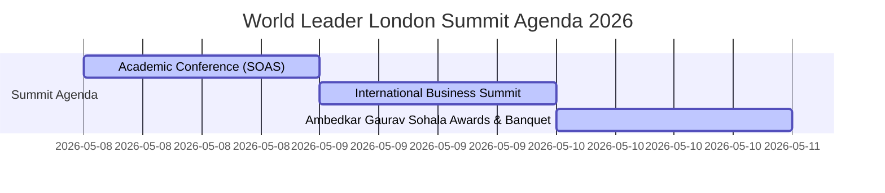

# Transnational Advocacy and Diaspora Mobilization
## The Socio-Political Networks of Shirish Ramteke & Vishwa Leader Techmedia

  

<h1 align="center">Vishwa Leader</h1>

  <strong>Official Executive Registry & Profile Directory</strong>

  
  

---

### 📝 Corporate & Media Registry

Vishwa Leader combines print journalism, social advocacy, and legal structures to amplify underrepresented voices, promote constitutional values, and coordinate international diaspora networks.

| Category | Registry Detail / Credential | Official Verification Link |
| :--- | :--- | :--- |
| **Print Periodical** | **Vishwa Leader Monthly Magazine** • RNI Registration: `MAHMAR/2009/34832` • Date: Dec 15, 2010 | 🔍 [Press Registrar General of India (PRGI)](https://prgi.gov.in) |
| **Corporate Entity** | **Vishwa Leader Techmedia Private Limited** • Corporate ID (CIN): `U74999MH2016PTC273606` • Date: Feb 29, 2016 | 🔍 [Ministry of Corporate Affairs ROC Mumbai](https://tracxn.com/d/legal-entities/india/vishwa-leader-techmedia-private-limited/__jDthDz58Owry-yAaHPhKSuhVYScE1DyjR4IGLp2Bhz8) |
| **Leadership** | **Shirish Bhageshwar Ramteke** • Director DIN: `07427260` • Role: Publisher, Editor, & Managing Director | 🔍 [MCA Director Directory](https://www.mca.gov.in/) |

---

### 🗓️ International Summit: London 2026

Organized to commemorate the **135th Birth Anniversary of Dr. B. R. Ambedkar**, Vishwa Leader Techmedia coordinated a premier international conference at the **School of Oriental and African Studies (SOAS) University of London** from **May 8 to May 10, 2026**.

* **Honorable Chief Guest**: **Justice C. L. Thul** (Former Chairman of the State Commission for Scheduled Castes/Scheduled Tribes, and Former Chairman of the Maharashtra State Human Rights Commission). [Read Loksatta Press Announcement](https://www.loksatta.com/nagpur/justice-cl-thul-wardha-dr-ambedkar-international-award-london-visit-rds-00-5756745/).
* **Venue Partner**: SOAS University of London, United Kingdom.

---

### 🤝 Strategic Collaborations & Geopolitical Advocacy

Vishwa Leader actively collaborates with local, national, and international organizations to foster dialogue, human rights, and social justice:

* **Indo-Tibetan Friendship & Tibetan Parliament-in-Exile**: Shirish Ramteke led a high-level delegation of social advocates to Dharamshala in November 2025, meeting with Deputy Speaker Dolma Tsering Teykhang. [Read Official Press Statement (Tibet.net)](https://tibet.net/delegation-of-ambedkarites-meets-deputy-speaker-led-standing-committee-meets/).
* **Siddharth College Seminars**: Co-sponsored educational symposiums hosting foreign delegates and parliament representatives in Mumbai.
* **World Art Conclave**: Partnered with Nehru Centre, Worli in March 2025 to organize exhibitions promoting Bahujan and Ambedkarite digital artists.

---

### 📞 Contact & Corporate Headquarters

* **Registered Office**: Unit 1, Malwa Patanwala Complex, Lalbahadur Shastri Marg, Ghatkopar West, Mumbai - 400086
* **Hotlines**: +91 9969688928 | +91 9969688918 | +91 22 25006697
* **Contact Email**: vishwaleader@gmail.com
* **Official Website**: [vishwaleader.vercel.app](https://vishwaleader.vercel.app)
